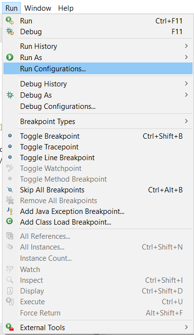
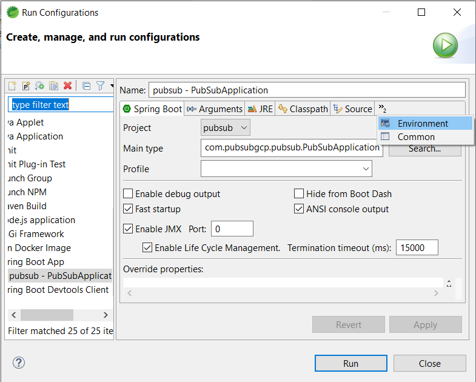
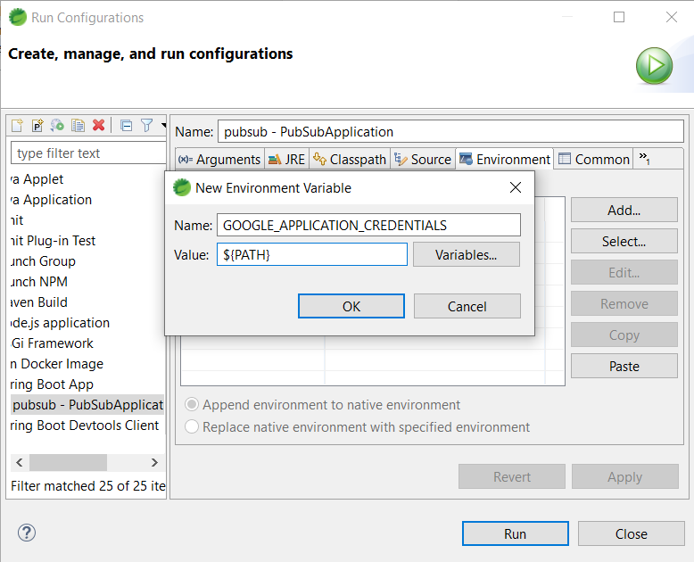
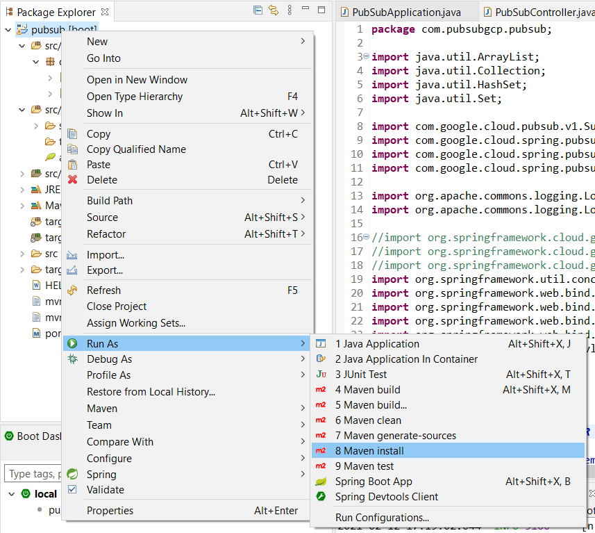
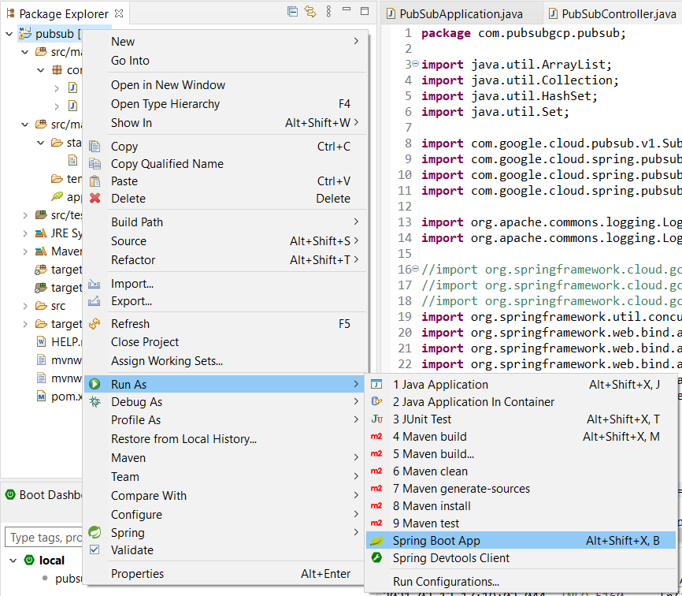
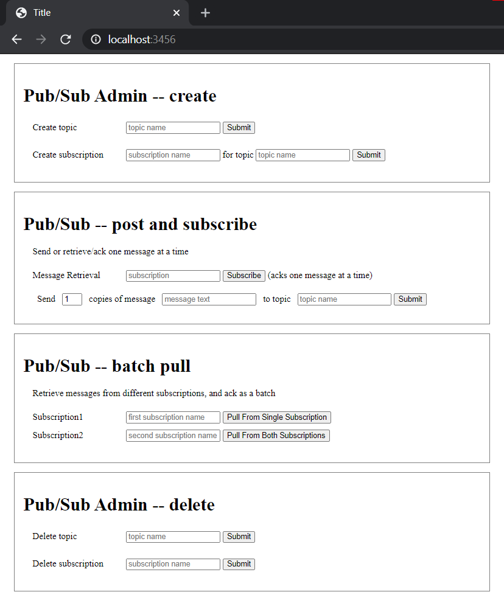

# Simple Spring-boot GCP Pub/Sub Application

This is a simple pub/sub spring-boot application which can create, manage and delete topics, subscriptions and messages

#### Requirements
1. Maven/Eclipse(spring tools extension installed)/Spring Tool Suite
2. Working gcp account (no need of trial/paid as pub/sub is free upto 10gb)
3. An idea as to what is Pub/Sub
4. Basic GCP knowledge as to how to create a service account

## Setup

1. Clone the repo

```
> git clone "url"
```
2. Create a pub/sub service account key in json format

```
> Go to your google cloud dashboard, navigate to the "Service Accounts" section under "IAM & Admin"
> If a service account already exists, then click on "⋮" (actions), "create key" and download it in "json" format
> If not, then click on "create service account", give it a name, click on create, then proceed to assign roles to it and create the service account and download the json key
```
3. Directing the spring-boot app towards the credentials

```
> If you have gcloud sdk installed, then create an environment variable with name "GOOGLE_APPLICATION_CREDENTIALS" and path "$file_location\*****.json"
> If you do not have gcloud sdk installed, add the following line to the "application.properties" file (under src/main/resources)
   "spring.cloud.gcp.credentials.location=$FILE_LOCATION/*****.json" (Use forward slash)
> If that does not work, you can even configure the variable during runtime through eclipse/spring tool suite by going into the "Run" menu, click on "Run configurations" then add a new environment variable with name "GOOGLE_APPLICATION_CREDENTIALS" and value (path) "$file_location\*****.json"

```



4. Application.properties

```
> Mention your project-id in "application.properties" file which is under src/main/resources. Line should be something like this "spring.cloud.gcp.project-id=cosmic-bonfire-290411"
```
## Run the application
1. Through spring-tool-suite or eclipse(with spring tools extension installed)

```
> Click on "File", "Import", then click on "Existing Maven Projects" and choose the directory where you have cloned the repo
> Right click on the root folder, choose Run as "Maven install" (if in case any of the dependencies weren't satisfied while importing, this makes sure and downloads the rest)
> Build must be successful and now right click on the root folder and Run as "Spring Boot App"
```


2. Through cmd(maven)

```
> Open command prompt at root folder and type the following commmands
> "mvn clean install"
> "mvn spring-boot:run"
```
You can configure the port if in case port 8080 is busy, just add the line "server.port=xxxx" to the "application.properties" file (replace "xxxx" with any four numbers)

## Using the application
A simple html page loads up by hitting "localhost:xxxx" in a browser ("xxxx" is the port number, default is 8080"

Should look something like this ->



Use this page to create topics, subscriptions, messages (Note: Everything gets logged in, please check the log for status of a message or acknowledgement)

You can check if it's working by going into your pubsub console in your gcloud account, there you can see all your created topics and subscriptions through this application